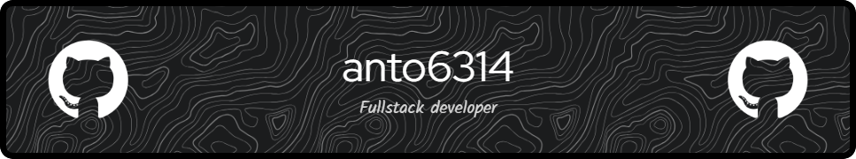

 
 <h2 align="center">Profile</h2>

### Hello everyone 👋 I'm anto6314.

> Developer

- 🌱 I’m currently learning **Next.JS**

- 👨‍💻 All of my projects are available at [https://github.com/fanto6314](https://github.com/fanto6314)

- 💬 Ask me about **ReactJS, NodeJS**

- 📫 Business Inquiries **antonio.foresta04@gmail.com**

### Github Stats

&nbsp;

